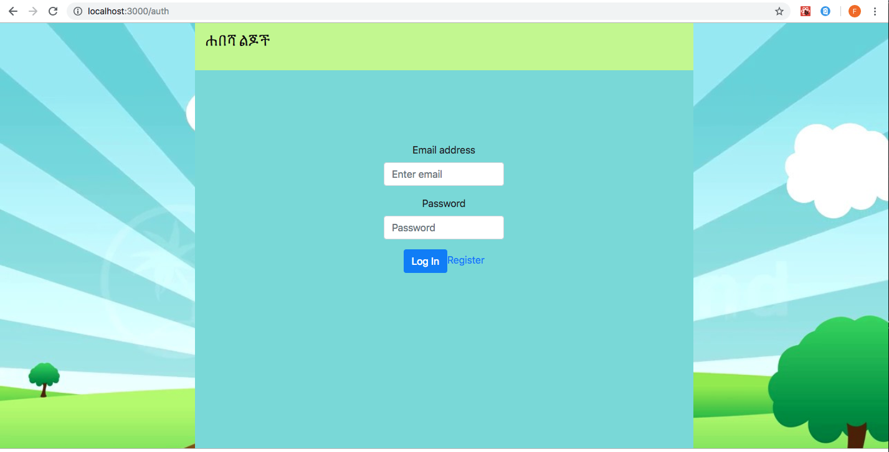
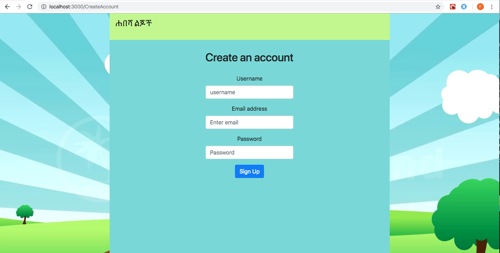
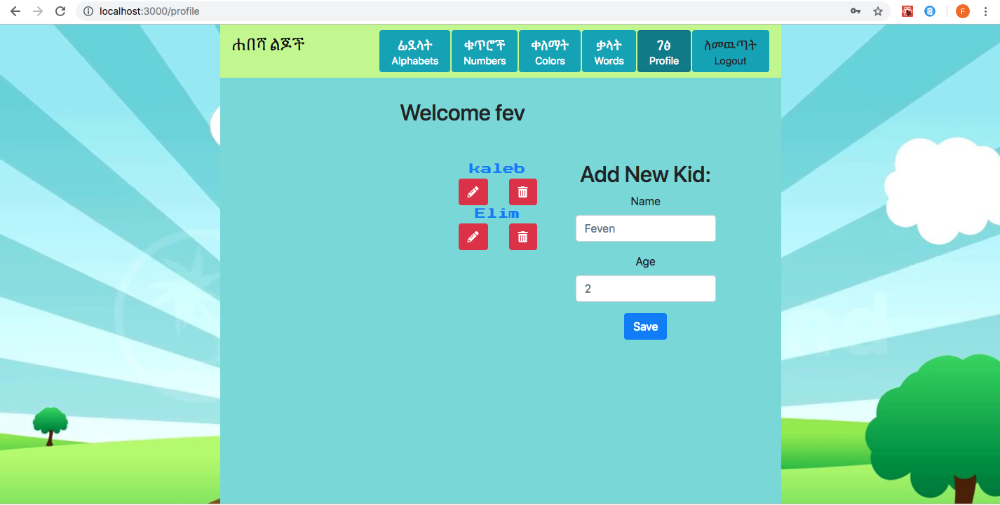
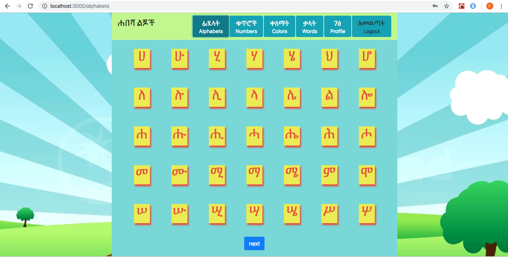
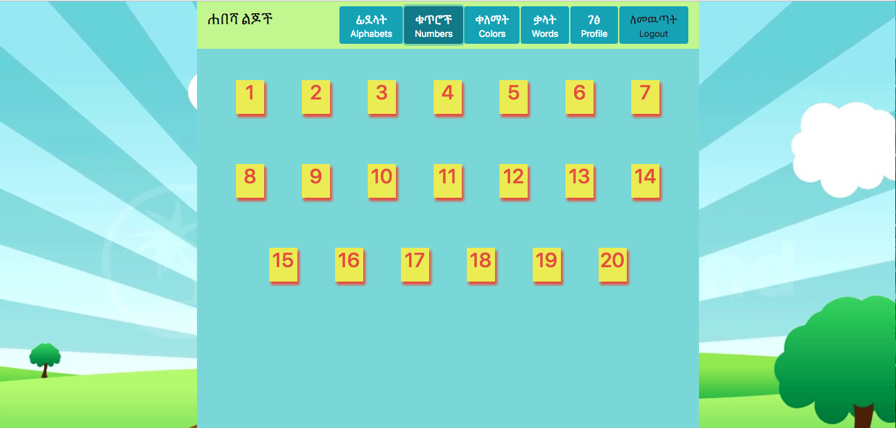
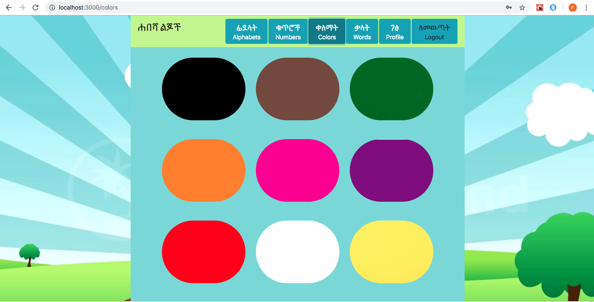

# Habesha Kids
This application is educational app for kids. I have designed the app with Amharic(Ethiopian language), I came up with this idea because of what I see in my community. I have seen the struggle for Ethiopian parents to teach their kids their language. They either say they are too busy to sit and teach their kids the language or the kids will not be interested since there are no good resources. 

This is what this application addresses, it is easy to use and fun for the kids. It has four pages: Alphabets, Numbers, Words and Colors page. To use this app, parent needs to create an account and they can add as many kids as they want. The kid can click on their name and go to the home page. 

If the kid clicks on Alphabets page, they will see all Amharic alphabets and they can click on each letters to learn the sound. The rest three page also have the same functionality. 

## Screenshots

1. Login Page

2. Create Account

3. Profile Page

4. Alphabets

5. Numbers

6. Colors 

## Technologies used 
* SASS
* Webpack
* Axios
* ES6 Modules
* Firebase
* React

## How to run this project:
- npx create-react-app my-app
- npm init react-app my-app
- create firebase project and add 
- "parents": {
      ".indexOn": "uid"
    },
      "kids": {
      ".indexOn": "uid"
    }
- copy apiKey and use the same structure as apiKeys.js.example 
- run `nmp install`
- And do `npm start` to run the project